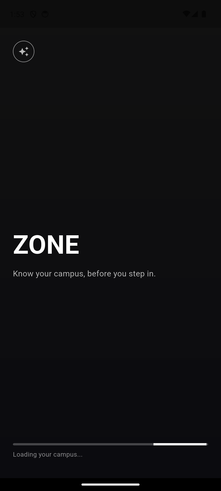
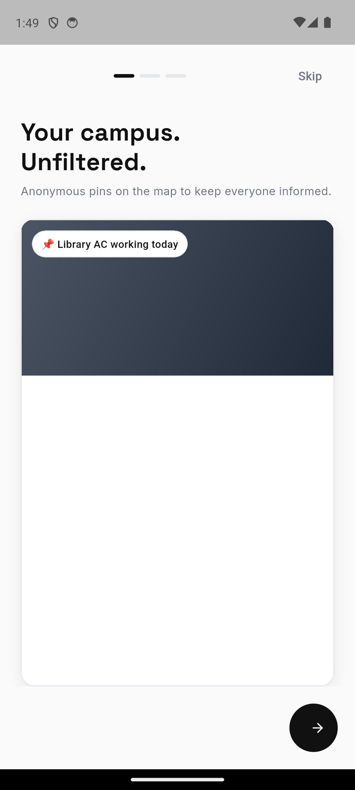
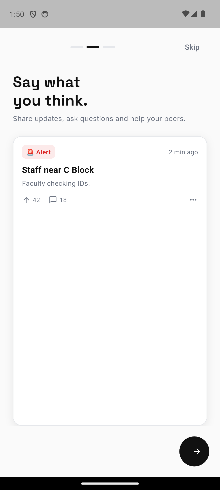
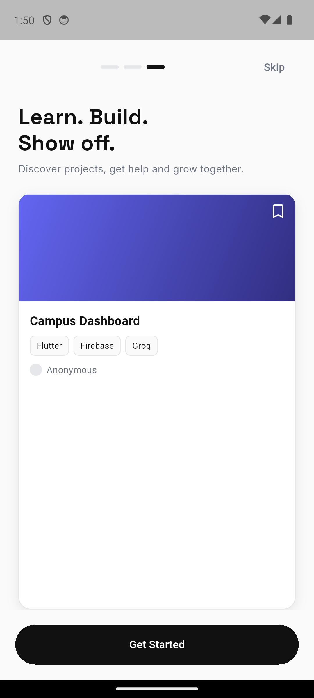
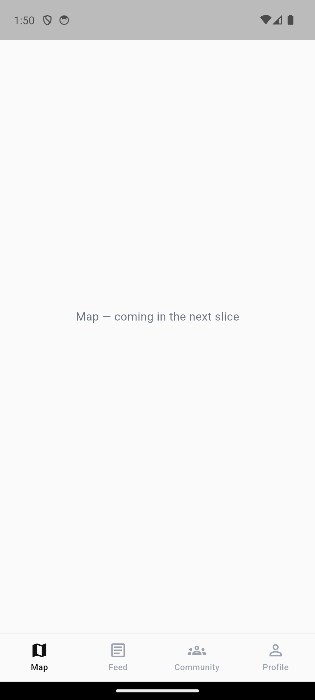
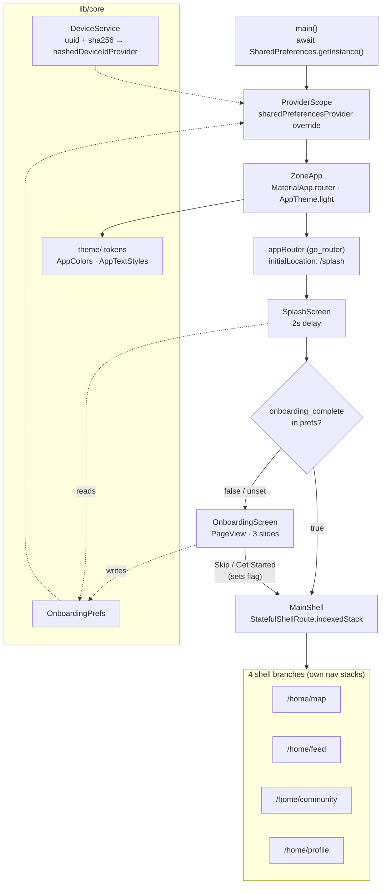

<div align="center">

<pre>
.-') _                  .-') _   ('-.
  (  OO) )                ( OO ) )_(  OO)
,(_)----. .-'),-----. ,--./ ,--,'(,------.
|       |( OO'  .-.  '|   \ |  |\ |  .---'
'--.   / /   |  | |  ||    \|  | )|  |
(_/   /  \_) |  |\|  ||  .     |/(|  '--.
 /   /___  \ |  | |  ||  |\    |  |  .--'
|        |  `'  '-'  '|  | \   |  |  `---.
`--------'    `-----' `--'  `--'  `------'
</pre>

**know your campus, before you step in — anonymous campus social app for CIT**

<br/>

[](https://flutter.dev)
[](https://dart.dev)
[](https://riverpod.dev)
[](https://pub.dev/packages/go_router)


</div>

---

## ⚡ What is ZONE?

**ZONE** is an anonymous campus social app for **Chennai Institute of Technology** — a map of anonymous pins for real-time campus intel ("Library AC working today", "Staff near C Block"), a feed for updates and questions, a community space, and a project showcase. No names, no profiles to maintain — identity is a hashed device ID.

> Know your campus, before you step in.

### 🚧 Project status

ZONE is built **one feature slice at a time**, each with its own design spec → plan → build cycle (see [`docs/superpowers/`](docs/superpowers)). This repo currently contains the **foundation slice**:

| Slice | Scope | Status |
|:---|:---|:---|
| **Foundation** | Bootstrap · theme tokens · routing · anonymous device identity · Splash · 3-slide Onboarding · 4-tab app shell (placeholder bodies) | ✅ Built |
| Map | Anonymous campus map + pin drops | 🔜 Next |
| Feed | Posts, alerts, semantic flair chips, up/down votes | 🔜 Planned |
| Community | Anonymous discussion spaces | 🔜 Planned |
| Profile | Karma, college verification (OTP), dark-mode toggle | 🔜 Planned |
| Backend | Firebase · Groq AI · push notifications · admin dashboard | 🔜 Planned |

Every tab beyond the shell currently renders `"<Tab> — coming in the next slice"`.

---

## 📸 Screenshots

> Real captures from a debug build running on an Android 14 emulator (Pixel 7).

| Splash | Onboarding · 1 | Onboarding · 2 |
|:---:|:---:|:---:|
|  |  |  |

| Onboarding · 3 | App shell (4 tabs) |
|:---:|:---:|
|  |  |

---

## ✨ What's in the foundation slice

- 🎬 **Splash** — dark gradient, sparkle mark, `ZONE` wordmark + tagline, indeterminate progress bar. After 2 s it reads the onboarding flag and routes to Onboarding or straight to the app shell.
- 👋 **3-slide onboarding** — a `PageView` with a segmented progress pill and an always-present **Skip**. Each slide pairs a Space Grotesk headline with a realistic **mock card**: a map-pin chip, a feed alert post (flair chip · timestamp · votes · comments), and a project-showcase card (gradient cover · tech chips · "Anonymous"). Circular black next-arrow; final slide swaps it for a full-width **Get Started**.
- 🧭 **4-tab app shell** — `StatefulShellRoute.indexedStack` bottom nav (Map · Feed · Community · Profile). Each branch keeps its own navigation stack; tab switches fire `HapticFeedback.selectionClick()`. Active `#111111` / inactive `#9CA3AF`, hairline top border.
- 🕶️ **Anonymous identity** — a `uuid` v4 is generated once and persisted; `hashedDeviceId = sha256(uuid + salt)` truncated to 16 hex chars, exposed as a Riverpod `FutureProvider` so later features (karma, verification) read one stable ID.
- 🎨 **Token-driven theme** — every colour and text style is a named constant in `core/theme/`, never raw hex in widgets. Light-only for this slice; a dark toggle lands with the Profile slice.

---

## 🛠️ Tech Stack

| Layer | Technology |
|:---|:---|
| **Language / SDK** | Dart 3.12, Flutter 3.12+ |
| **UI** | Material 3, light theme, `#FAFAFA` canvas, solid-black pill CTAs |
| **State management** | Riverpod 3 (`flutter_riverpod`) — `ProviderScope` with a `SharedPreferences` override |
| **Routing** | go_router 17 — `/splash`, `/onboarding`, `StatefulShellRoute.indexedStack` for the tab shell |
| **Fonts** | `google_fonts` — Space Grotesk (display) + Inter (body) |
| **Local storage** | `shared_preferences` — onboarding flag, device UUID |
| **Identity / crypto** | `uuid` (v4) + `crypto` (`sha256`) |
| **Testing** | `flutter_test` — 18 unit / widget / integration tests |

---

## 🏗️ Architecture

Layered, feature-first Flutter. `main()` builds one `ProviderScope` (injecting `SharedPreferences`), everything else reads state through Riverpod providers; widgets never touch `SharedPreferences` directly.



### Anonymous identity

```
uuid = Uuid().v4()                         // generated once, persisted in SharedPreferences
hashedDeviceId = sha256(uuid + "zone_salt_2024").hex[:16]
```

`hashedDeviceIdProvider` (a `FutureProvider<String>`) is the single source every future feature reads — the raw UUID never leaves the device, and the 16-char hash is what karma / verification / moderation will key on.

---

## 📂 Project Structure

```
lib/
├── main.dart                     # ProviderScope + SharedPreferences override → ZoneApp
├── core/
│   ├── device/                   # DeviceService — anonymous UUID + sha256 hash + providers
│   ├── prefs/                    # OnboardingPrefs — onboarding-complete flag
│   ├── router/                   # app_router.dart — go_router (splash · onboarding · shell route)
│   └── theme/                    # AppColors, AppTextStyles (Space Grotesk + Inter), AppTheme.light
└── features/
    ├── splash/                   # SplashScreen — 2s delay + routing
    ├── onboarding/               # OnboardingScreen + onboarding_slide.dart
    │   └── widgets/              # progress pill + map-pin / feed-post / showcase mock cards
    └── shell/                    # MainShell (4-tab bottom nav) + PlaceholderTab

test/                             # 18 tests mirroring lib/  (+ app_integration_test.dart)
docs/superpowers/                 # per-slice design specs + implementation plans
```

---

## 🚀 Getting Started

### Prerequisites

- **Flutter SDK ≥ 3.12** (Dart 3.12) — `flutter doctor` clean
- An Android emulator / device, iOS simulator, or Chrome (web is enabled)

### Run

```bash
git clone https://github.com/shaktivijayas/zone.git
cd zone
flutter pub get
flutter run                 # pick a device, or:
flutter run -d chrome       # runs on web
```

First launch: Splash (2 s) → Onboarding → **Skip** or **Get Started** → app shell. Relaunch and Splash jumps straight to the shell (the onboarding flag is now set). To replay onboarding, clear app data / site data.

---

## 🧪 Testing

```bash
flutter analyze     # zero warnings
flutter test        # 18 tests
```

| Area | Coverage |
|:---|:---|
| **Splash** | 2 s delay is honoured; routes to onboarding vs. shell based on the prefs flag |
| **Onboarding** | first slide renders; swipe through all 3 + Get Started navigates home; Skip navigates home |
| **Main shell** | Map shown by default; tapping a tab switches branch |
| **DeviceService** | `sha256` hashing against a known-answer vector; UUID persists across calls |
| **OnboardingPrefs** | flag defaults to `false`, flips to `true` |
| **Theme** | colour tokens match the spec |
| **Integration** | full flow splash → onboarding → skip → main shell (`app_integration_test.dart`) |

---

## 🎨 Design Tokens

From the reference UI (`zone ui.png`) — a clean, **light-first** look (the original text spec's dark theme was deliberately dropped for this build). Solid black CTAs, no invented accent colour.

| Token | Value | Use |
|:---|:---|:---|
| `background` | `#FAFAFA` | app canvas |
| `textPrimary` / `ctaBlack` / `navActive` | `#111111` | headings, CTA fills, active nav |
| `textSecondary` | `#6B7280` | subtext, timestamps |
| `navInactive` | `#9CA3AF` | inactive nav item |
| `cardBorder` | `#E5E7EB` | hairline card / nav borders |
| `cardFill` | `#FFFFFF` | card surfaces |
| Semantic flair | Alert `#DC2626` · Hot `#EA580C` · Info `#D97706` · Chill `#16A34A` | pin / post flair chips (meaning colours, app-wide) |
| Fonts | Space Grotesk (display) · Inter (body) | via `google_fonts` |

---

## 🗺️ Roadmap

Next slices, each brainstormed and specced on its own before build:

1. **Map** — campus map with anonymous pin drops (illustrated background first, real maps later).
2. **Feed** — posts, alerts, semantic flair, voting, comments.
3. **Community** — anonymous discussion spaces.
4. **Profile** — karma, optional college verification (OTP), dark-mode toggle.
5. **Backend** — Firebase, Groq AI moderation/assist, push notifications, admin dashboard.

---

## 📄 License

No `LICENSE` file is currently included in this repository — all rights reserved by the author. Add one to make reuse terms explicit.

---

<div align="center">

`⚡ built with flutter + riverpod`

</div>
